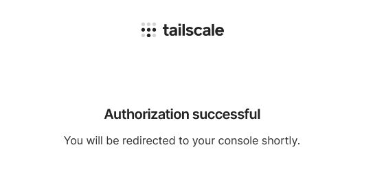
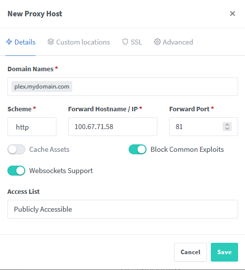

I love selfhosting my own services, especially services like Plex and the *arr stack that can often be resource intensive resulting in expensive bills when using Cloud Providers.

I have a [Mini PC](https://amzn.eu/g5ZFZsw) and an [external drive](https://amzn.eu/d0gUu1G) that I use to host my Plex installation alongside many other services however my ISP support port forwarding making it difficult to access these services when myself or friends would like to watch something on Plex without being physically here.

You can do this using something like [Tailscale](https://tailscale.com) which creates a network between devices you've set up using the program so they can interact as if they were on the same physical network - This works great however:

 - Plex still alerts you that remote access is unavailable
 - Not every device supports Tailscale
 - Not everyone wants to install an extra app just to connect to your Plex server.

So after a fair amount of research and head-scratching I finally found a couple of reliable solutions that allow you to do this.

## Solution 1

### Proxy your Plex server through a VPS

This is what I did for a while to *okay* results. I created a VPS on a platform such as [AWS Lightsail](https://aws.amazon.com/lightsail/) or [Hetzner](https://www.hetzner.com/), connected my home server to it using an [SSH tunnel](https://linuxize.com/post/how-to-setup-ssh-tunneling/) or [Tailscale](https://tailscale.com) and then used a reverse proxy such as [Nginx Proxy Manager](https://nginxproxymanager.com/) or [Caddy](https://caddyserver.com/).

This guide will show you how to do this on a Debian-based server (I like Ubuntu 20.04) using Tailscale and Nginx Proxy Manager in a Docker container.

Please make sure you have Docker with the Docker Compose plugin set up before following this guide.


#### 1. - Setup your Tailscale account

Go to Tailscale and [get started](https://login.tailscale.com/start) and Log in with Google, Microsoft or Github.

You'll then be shown this screen:


Your account is now set up and we can get started.

#### 2. - Install Tailscale on your VPS and Homeserver

Log in to your VPS and run the following command:

```console
$ curl -fsSL https://tailscale.com/install.sh | sh
```

This will install Tailscale automatically - if you have any problems follow the [manual installation guide](https://tailscale.com/download/linux)

When you see the following output and returned back to your terminal Tailscale has been installed.
```
Installation complete! Log in to start using Tailscale by running:

tailscale up
```

Then do what the prompt suggests - Run

```console
$ tailscale up
```

It'll then return a link to log in like the following:
```
To authenticate, visit:

    https://login.tailscale.com/a/137nr938hr32f23g
```

Go to this link on a local browser and log in with your account.



Then repeat the above steps on your homeserver

#### 3. Get the Tailscale IP of your homeserver

Run the following command on your homeserver to get your Tailscale IP

```console
$ tailscale ip
```

It should return something like the following:

```
100.67.71.58
fd7a:115c:a1e0:ab12:4843:cd96:6243:473a
```

Make note of this first IP (100.67.71.58) - you'll need it for later

#### 4. Set up Nginx Proxy Manager

Paste the following content into a file called `docker-compose.yml` in a new, blank directory

```yaml title="docker-compose.yml"
version: '3'
services:
  app:
    image: 'jc21/nginx-proxy-manager:latest'
    restart: unless-stopped
    ports:
      - '80:80'
      - '81:81'
      - '443:443'
    volumes:
      - ./data:/data
      - ./letsencrypt:/etc/letsencrypt
```

Then start the container detached.

```console
$ docker compose up -d
```

If you go to your VPS's IP on port 81 in your browser you should see the Nginx Proxy Manager Admin Interface

Example:
`http://192.168.1.5:81`

Log in with the default credentials:

```
Email:    admin@example.com
Password: changeme
```

and make sure to instantly change them to keep other people out of your admin interface!

#### 5. Add your domain

Go to `Hosts > Proxy Hosts` on Nginx Proxy Manager


Then click `Add Proxy Host` and add in the following:

 - Domain Names
   - A domain record pointed at the public IP of your VPS. I chose plex.mydomain.com
 - Forward Hostname / IP
   - Your homeserver's Tailscale IP you got in [step 3](#3-get-the-tailscale-ip-of-your-homeserver)
 - Turn on `Block Common Exploits` and `Websockets Support`



Then go to the `SSL` tab and select:
 - SSL Certificate
   - Request a new SSL Certificate
 - Force SSL
 - HTTP/2 Support
 - Type in your email under `Email Address for Let's Encrypt` so you can be notified to renew your SSL certificate
 - Then agree to the Let's Encrypt Terms of Service (Obviously after you've read it all first 😉)
 - Then click save

If all went right you should be able to access Plex at `plex.mydomain.com`

## Solution 2

This is my preferred method as it ensures plex remote access works well although you do need a VPN - Luckily as I pay for one anyway this was done for no extra cost to me.

We'll be using [Gluetun](https://github.com/qdm12/gluetun) to port forward Plex's port to a remote IP and [socat](https://hub.docker.com/r/alpine/socat) to remap plex's port if you can't forward 32400 to your VPN provider.

I recommend [Mullvad](https://mullvad.net) for this as it's €5/month nomatter how long you buy it for, it supports 5 devices, has pretty good speeds and most importantly supports IP forwarding.

The first couple steps will be how to set up port forwarding on Mullvad. You'll have to find a different guide or work out how to do this on other VPN providers. Skip [here](#4-add-gluetun-to-your-docker-compose-file)

#### 1. Create a Mullvad account

Go to Mullvad and [create an account](https://mullvad.net/en/account/#/create/)

Click generate account number - It'll be something like `0117232244133488` - This is your login for Mullvad. Don't lose it.

Add time to your account. You can do this in many ways. Use credit card or PayPal for ease of use but if you want to be more sure that your identity can't be linked to this account use a Cryptocurrency like Bitcoin or Monero (You also get a 10% discount).

#### 2. Create a wireguard configuration

Go to the [WireGuard configuration file generator](https://mullvad.net/en/account/#/wireguard-config)

and click `Generate Key` - This will create a new device on your Mullvad account.

Select a country, city and server. I recommend choosing one closest to you for the best speeds. Check the [servers page](https://mullvad.net/en/servers/) to get a more detailed list of each server and filter it to suit your needs.

I chose `UK` `London` `gb-17-wireguard`

Then download the file - You'll need this later.

#### 3. Create a forwarded port on Mullvad

Go to the [devices page](https://mullvad.net/en/account/#/devices) and find the device you created earlier.

Click `add port` and select your City. Then click add port.

It'll then add a forwarded port to the list below. You can have up to 5.

Mine looks like this:
`gb-lon-57788`

57788 is the Mullvad forwarded port.


#### 4. Add gluetun to your docker compose file

Add the following service to your `docker-compose.yml` file

```yaml title="docker-compose.yml"
services:
    gluetun:
        image: qmcgaw/gluetun
        cap_add:
            - NET_ADMIN
        environment:
            - VPN_SERVICE_PROVIDER=mullvad
            - VPN_TYPE=wireguard
            - WIREGUARD_PRIVATE_KEY= # PrivateKey in your .conf file you downloaded in step 2
            - WIREGUARD_ADDRESSES= # Address in the .conf file. Only paste in the first one e.g. 10.64.192.251/32
            - SERVER_HOSTNAMES= # Mullvad server name, e.g. gb17-wireguard.
            - FIREWALL_VPN_INPUT_PORTS= # Mullvad forwarded port, e.g. 57788
        ports:
        - 32400:32400/tcp # Your plex ports - copy this from your existing setup.
        - 3005:3005/tcp
        - 8324:8324/tcp
        - 32469:32469/tcp
        - 1900:1900/udp
        - 32410:32410/udp
        - 32412:32412/udp
        - 32413:32413/udp
        - 32414:32414/udp
```

Then add `network_mode: "service:gluetun"` to your plex container and remove the `ports` section from your plex container.

This may be all you need to do but if you're using a provider like Mullvad where the port you get probably won't be `32400` you'll need to reroute this port locally.

#### 5. Reroute the local port

We're going to use socat for this.

Add in the following to your docker compose file.

```yaml
    socat:
        network_mode: "service:gluetun"
        image: alpine/socat
        command: "TCP-LISTEN:57788,fork,reuseaddr TCP-CONNECT:localhost:32400"
        restart: always
```

Replace `57788` with your forwarded port

Then start the container

```
docker compose up -d
```

It should output the following after a few seconds

```
[+] Running 3/0
    ⠿ Container    plex-gluetun-1  Running 0.0s
    ⠿ Container    plex-socat-1    Running 0.0s
    ⠿ Container    plex            Running 0.0s
```

However - We might not know the IP the gluetun is connecting to

### 6. Get the VPN IP

Run the following command

```console
$ docker exec -it plex-gluetun-1 wget -qO- icanhazip.com
```

It should then return the IP of your VPN server.

For example: `37.120.198.146`

Then go to the VPN server's IP on the forwarded port

For example:

`http://37.120.198.146:57788`

If this shows your plex installation it's all worked!

Go to the remote access page on plex and set the manual port to your forwarded port if you've having any issues with plex saying it's not working.